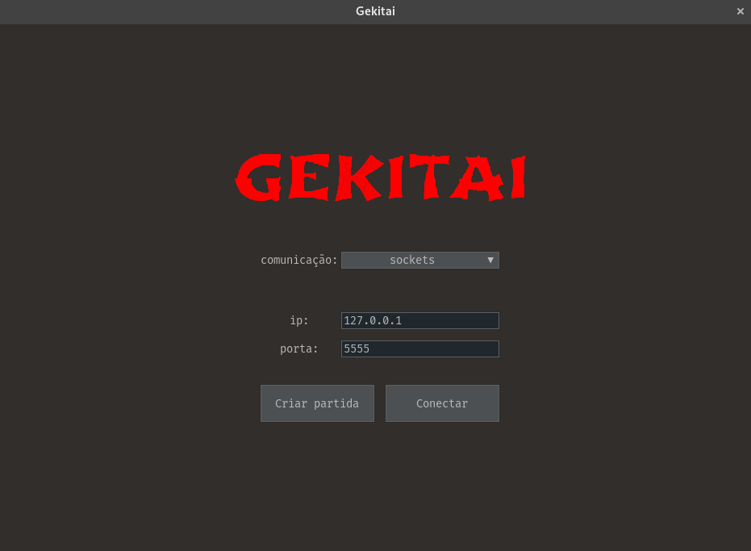
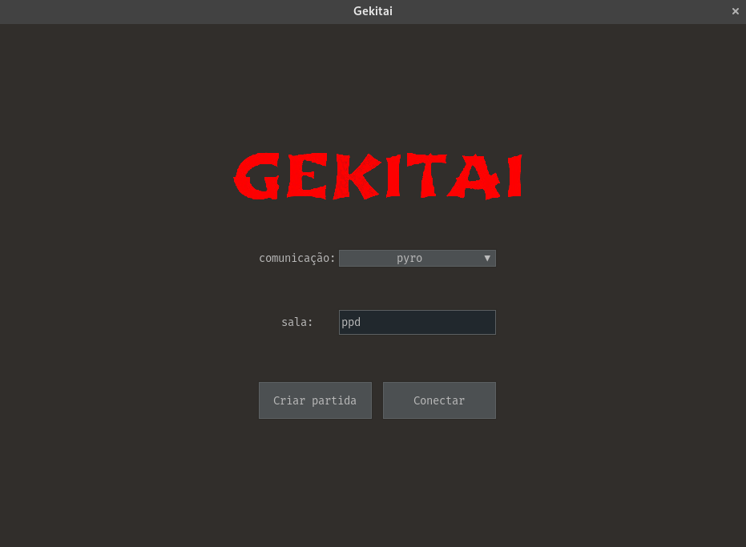
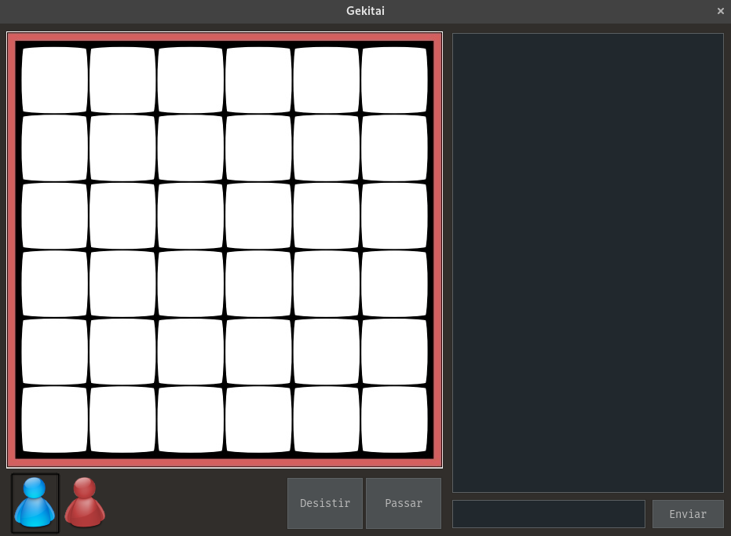

# Gekitai

Esse programa foi feito para a disciplina de Programação Paralela e Distribuida do curso de engenharia da computação
no IFCE do semestre 2023.1. O objetivo era utilizar sockets ou pyro (RPC) para implementar a comunicação peer-to-peer
entre os aplicativos clientes.

Como o foco era a comunicação entre aplicativos, as regras do jogo não foram implementadas. Outros requisitos do
trabalho eram o chat, sistema de passagem de turno, desistência e checagem do vencedor.

<p align="center">
    <a href="https://raw.githubusercontent.com/rafaellcoellho/othello/master/docs/menu_sockets.png">
		
	</a>
</p>

<p align="center">
    <a href="https://raw.githubusercontent.com/rafaellcoellho/othello/master/docs/menu_pyro.png">
		
	</a>
</p>

<p align="center">
	<a href="https://raw.githubusercontent.com/rafaellcoellho/othello/master/docs/jogo.png">
		
	</a>
</p>

## Desenvolvimento

#### Configurando ambiente local

Instalar versão do python. Eu utilizo o [asdf](https://asdf-vm.com/), com o plugin
[asdf-python](https://github.com/asdf-community/asdf-python) para fazer isso:

```
$ asdf install python 3.10.4
```

O arquivo `.tool-versions` vai reconhecer que nessa pasta utilizamos a versão correta:

```
$ python --version
Python 3.10.4
```

Crio e iniciar o ambiente virtual:

```
$ virtualenv venv
[...]
$ . venv/bin/activate
```

Instalar as dependências de desenvolvimento:

```
$ pip install -r requirements.txt
```

Instalar a configuração do pre-commit:

```
$ pre-commit install
```

#### Como rodar testes

Rodar todos os ambientes de testes que tiver na sua máquina:

```
tox --skip-missing-interpreters
```

Rodar ambiente de teste especifico e teste especifico:

```
tox -e py310 -- tests/test_main.py::test_inicial
```

#### Compilando o binário

Instalar [PyInstaller] no ambiente virtual:

```
$ pip install pyinstaller
```

Agora basta usar a lib para criar o executável:

```
$ pyinstaller gekitai.spec
```

## Referências

+ [Descrição do jogo Gekitai](https://tesera.ru/images/items/1665162/Gekitai_Rules.pdf)
